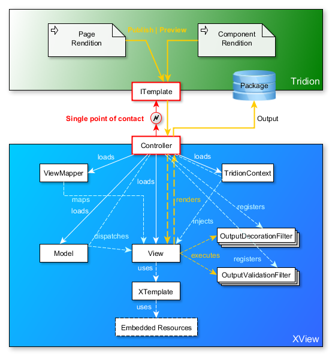

# XView

XView is a decoupled SDL Tridion TOM.NET templating solution designed to simplify TOM.NET templates development and to advance maintainability. 

XView addresses the shortcomings and awkwardness of other known SDL Tridion Compound Templating solutions by providing a practical, powerful and easy to use TOM.NET framework. The loosely coupled MVC architecture makes fast and clean templates development possible.

The diagram below illustrates the XView decoupled architecture.


## Highlights

* Develop and maintain TOM.NET templates outside Tridion.
* Develop and structure TOM.NET templates in a Model-View-Controller manner.
* Single Controller (template building block) to handle all compound templates.
* Clean separation of C# and HTML with XTemplate.
* Unlimited nested block parsing with XTemplate.
* Unlimited nested scoped partial view rendition.
* Centralized and fine-grained control over output decoration and validation.
* Data sharing between different template scopes.
* Direct access to TOM.NET API, .NET BCL and any .NET library available.
* Extensible.
* In-memory caching of objects.
* Lightweight and fast.
* Pleasant TOM.NET templating experience.
* No installation required.
* Supports Tridion 2011, Tridion 2013 and Web 8

Check out some XView code samples here: [url:https://github.com/hoangchu/xview-codesamples]

## Example C# code.
```csharp
public class ArticleView : View<Component>
{
    protected override string Render()
    {
        var xt = new XTemplate(Layout.ArticleView);

        xt.Assign("Title", Model.GetText("title"));
        xt.Assign("Introduction", Model.GetText("introduction"));
        xt.Assign("BackToTopLabel", Context.TranslateLabel("Back to top"));

        int paragraphIndex = 0;

        foreach (var paragraph in Model.GetEmbeddedFields("paragraphs"))
        {
            paragraphIndex++;

            xt.Assign("ParagraphTitle", paragraph.GetText("title"));
            xt.Assign("ParagraphText", paragraph.GetText("text"));
            xt.Assign("ParagraphIndex", paragraphIndex.ToString());

            Component image = paragraph.GetComponent("image");

            xt.Assign("ParagraphImage", image != null 
                ? RenderPartial<ImageView>(image) 
                : string.Empty);

            xt.Parse("root.paragraph");
        }

        return xt.ToString();
    }
}
```

Same as above, but with dynamic XTemplate.
```csharp
public class ArticleView : View<Component>
{
    protected override string Render()
    {
        dynamic article = new XTemplate(Layout.ArticleView);

        article.Title = Model.GetText("title");
        article.Introduction = Model.GetText("introduction");
        article.BackToTopLabel = Context.TranslateLabel("Back to top");

        int paragraphIndex = 0;

        foreach (var paragraph in Model.GetEmbeddedFields("paragraphs"))
        {
            paragraphIndex++;

            article.ParagraphTitle = paragraph.GetText("title");
            article.ParagraphText = paragraph.GetText("text");
            article.ParagraphIndex = paragraphIndex.ToString();

            Component image = paragraph.GetComponent("image");

            article.ParagraphImage = image != null
                ? RenderPartial<ImageView>(image) 
                : string.Empty;

            article.Parse("root.paragraph");
        }

        return article.ToString();
    }
}
```

## Example HTML layout.
```html
<div id="content" class="content">
    <a name="top"></a>
    <div id="article-header">
        <h1 class="title-text">{Title}</h1>
    </div>
    <div class="intro-text">
        <strong>{Introduction}</strong>
    </div>
    <!-- BEGIN: paragraph -->
    <a name="p{ParagraphIndex}"></a>
    <div class="paragraph">
        <h3>{ParagraphTitle}</h3>
        {ParagraphImage}
        {ParagraphText}
        <div class="clearer"></div>
    </div>
    <div class="backtotop">
        <a href="#top">{BackToTopLabel}</a>
    </div>
    <!-- END: paragraph -->
</div>
```
